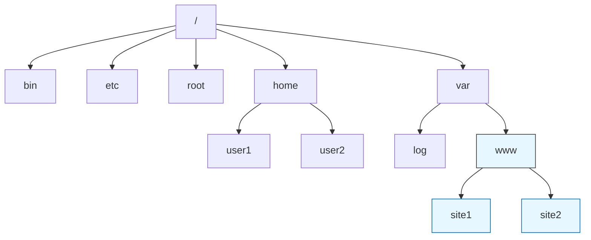

## Дерево каталогов 




```
/ — корневой каталог (root directory) — самая верхняя точка иерархии файловой системы
bin — системные исполняемые файлы
etc — конфигурационные файлы системы
home — домашние каталоги пользователей
user1
user2
var — изменяемые данные
log — логи системы
```


### Мастер‑класс «Базовые навыки работы в Linux (на примере Debian)» для педагогов дополнительного образования
 
**Продолжительность:** 30 минут.
**Цель:** познакомить педагогов с базовыми навыками работы в Linux и полезными  инструментами для использования в образовательном процессе.
**ОС:** Debian.

#### Структура мастер‑класса

**1. Вступление (3 минуты)**

- Приветствие, представление темы.
- Краткий обзор преимуществ Linux для образовательных целей:
  - бесплатность и открытость ПО;
  - безопасность и стабильность;
  - гибкость настройки;
  - возможность изучения основ работы с ОС на низком уровне.
- Демонстрация рабочего стола Debian.

**2. Основы работы с графическим интерфейсом (5 минут)**

- Обзор элементов интерфейса (панель задач, меню приложений, системный трей).
- Запуск приложений через меню или поиск.
- Работа с файловым менеджером (Dolphin или аналоги):
  - навигация по каталогам;
  - создание, копирование, перемещение и удаление файлов и папок;
  - просмотр свойств файлов.

**3. Терминал: основы и базовые команды (10 минут)**
Объяснение важности терминала для администрирования и автоматизации задач.
Демонстрация базовых команд:

- `$ ls` — просмотр содержимого каталога.
- `$ cd <путь>` — переход между каталогами.
- `$ pwd` — отображение текущего каталога.
- `$ mkdir <имя_папки>` — создание папки.
- `$ cp <источник> <назначение>` — копирование файлов.
- `$ mv <источник> <назначение>` — перемещение или переименование файлов.
- $ `touch` `<файл>`  — создание файлов.
- `$ rm <файл>` — удаление файлов.
- `$ cat <файл>` — просмотр содержимого файла.
- `$ sudo <команда>` — выполнение команды с правами администратора.

Практическое задание: создать папку `test`, перейти в неё, создать файл `file.txt`, скопировать его в другую папку, удалить оригинал.

```
$ mkdir test
$ pwd
$ cd test
$ touch file.txt
$ ls
$ cd ..
$ mkdir backup
$ cp test/file.txt backup/
$ cd test
$ rm file.txt
```

`

**4. Установка и обновление программ (5 минут)**
Работа с пакетным менеджером `apt`:

- `$ sudo apt update` — обновление списка пакетов.
- `$ sudo apt upgrade` — обновление установленных пакетов.
- `$ sudo apt install <имя_пакета>` — установка программы.
- `$ sudo apt remove <имя_пакета>` — удаление программы.

Пример: установка текстового редактора `nano`:

```bash
$ sudo apt install geany
```

**5. Полезные инструменты для педагогов (5 минут)**
Краткий обзор программ, полезных в образовательном процессе:

- **Офисные приложения:** LibreOffice (аналог Microsoft Office).
- **Графические редакторы:** GIMP (аналог Photoshop), Inkscape (векторная графика).
- **Программирование:**
  - Python (уже предустановлен в Debian);
  - Geany (простая IDE для начинающих);
  - Scratch (визуальное программирование для детей).
- **Мультимедиа:** VLC (медиаплеер), Audacity (аудиоредактор).
- **Удалённое управление:** VNC или TeamViewer (для демонстрации экрана ученикам).

**6. Заключение и ответы на вопросы (2 минуты)**

- Подведение итогов: что изучили за 30 минут.
- Рекомендации для самостоятельного изучения:
  - официальная документация Debian;
  - онлайн‑курсы по Linux;
  - сообщества Linux‑пользователей.
- Ответы на вопросы участников.

------

## Важные замечания

- **Осторожность с `rm`.** Команда `rm` удаляет файлы безвозвратно. Всегда проверяйте путь перед удалением.
- **Относительные и абсолютные пути.** В примере использованы относительные пути. Можно использовать абсолютные (например, `/home/user/test/example.txt`), если это удобнее.
- **Права доступа.** Убедитесь, что у вас есть права на запись в директориях, где вы создаёте папки и файлы.

---

#### Материалы для подготовки

- Виртуальная машина с Debian (для демонстрации).
- Список команд и программ на слайдах или раздаточном материале.
- Примеры файлов и папок для практических заданий.

#### Советы по проведению

- Говорите чётко и не слишком быстро — аудитория может быть не знакома с Linux.
- Показывайте каждое действие на экране, комментируйте команды.
- Дайте участникам время повторить команды в терминале.
- Будьте готовы к вопросам типа «А как сделать то же самое в Windows?» — кратко объясните различия.
- Завершите мастер‑класс позитивным посылом: «Linux — это мощный и бесплатный  инструмент, который поможет вам и вашим ученикам освоить современные  технологии».

---

---

### План‑конспект учебного занятия в группе кружка

**Дата:** 13.02.2026
**Ф. И. О. педагога:** Токазин Юрий Викторович

**Тема:** «Базовые навыки работы в Linux (на примере Debian): знакомство с ОС и терминалом»

**Цель:** сформировать у обучающихся базовые навыки работы с операционной системой Linux (Debian), включая освоение графического интерфейса и основных команд терминала для использования в учебных и творческих проектах.

**Задачи:**

1. Познакомить с интерфейсом ОС Debian и его основными элементами.
2. Сформировать навыки работы с файловым менеджером: создание, копирование, перемещение и удаление файлов и папок.
3. Познакомить с понятием терминала и его ролью в управлении ОС.
4. Отработать на практике базовые команды терминала (`ls`, `cd`, `pwd`, `mkdir`, `cp`, `mv`, `rm`, `touch`, `cat`, `sudo`).
5. Научить устанавливать программы через пакетный менеджер `apt`.
6. Продемонстрировать полезные образовательные программы в Linux.
7. Развить навыки самостоятельной работы с ОС и решения типовых задач.

**Форма занятия:** комбинированная (фронтальная при объяснении, групповая при выполнении практических заданий, индивидуальная при отработке навыков).

**Оборудование (материально‑техническая база):**

- компьютеры с предустановленной ОС Debian (или виртуальной машиной с Debian);
- проектор и экран для демонстрации действий педагога;
- доступ в интернет (для обновления и установки программ);
- раздаточные материалы: шпаргалка с основными командами терминала и списком полезных программ;
- подготовленные файлы и папки для практических заданий.

------

#### План занятия

1. **Организационная часть** (3 мин):
   - приветствие;
   - проверка присутствующих;
   - объявление темы и целей занятия;
   - краткий инструктаж по технике безопасности при работе с ПК.
2. **Актуализация опорных знаний** (5 мин):
   - вопросы для обсуждения: «Что такое операционная система?», «Какие ОС вы знаете?», «Чем Linux отличается от Windows/macOS?»;
   - обсуждение преимуществ Linux для учебных целей (бесплатность, безопасность, гибкость).
3. **Освоение нового материала** (12 мин):
   - демонстрация интерфейса Debian: панель задач, меню приложений, системный трей;
   - работа с файловым менеджером (Nautilus): навигация, создание, копирование, перемещение, удаление файлов/папок;
   - введение в терминал: объяснение важности, запуск терминала;
   - показ базовых команд терминала с демонстрацией на экране;
   - установка программы через `apt` (пример: `Geany`).
4. **Закрепление новой темы** (7 мин):
   - выполнение практического задания в терминале: создать папку `test`, перейти в неё, создать файл `file.txt`, скопировать его в папку `backup`, удалить оригинал;
   - самостоятельная работа обучающихся с консультациями педагога.
5. **Рефлексия** (2 мин):
   - ответы на вопросы: «Что нового узнали?», «Что было самым сложным?», «Где можно применить эти навыки?»;
   - сбор обратной связи (короткая анкета или устные комментарии).
6. **Подведение итогов занятия** (1 мин):
   - обобщение изученного;
   - оценка работы группы;
   - рекомендации для самостоятельной практики (повторить команды, установить и попробовать LibreOffice, GIMP);
   - анонс следующего занятия.

------

#### Ход занятия

**1. Орг. часть (3 мин)**

- Приветствие. Проверка присутствующих.
- Объявление темы: «Сегодня мы познакомимся с ОС Linux на примере Debian и научимся работать в терминале».
- Постановка цели и задач. Инструктаж по ТБ.

**2. Теоретическая часть (12 мин)**

- **Обзор интерфейса Debian** (3 мин): показ элементов (панель задач, меню, трей), запуск приложений.
- **Работа с файловым менеджером** (4 мин): навигация, операции с файлами и папками (создание, копирование, перемещение, удаление).
- **Введение в терминал** (5 мин):
  - объяснение роли терминала;
  - запуск терминала, ввод первых команд (`ls`, `pwd`);
  - демонстрация команд: `mkdir`, `touch`, `cp`, `mv`, `rm`;
  - пример установки программы: `$ sudo apt install nano`.

**3. Практическая часть (7 мин)**

- Обучающиеся выполняют задание в терминале под руководством педагога:

  bash

- ```bash
  $ mkdir test
  $ cd test
  $ touch file.txt
  $ cd ..
  $ mkdir backup
  $ cp test/file.txt backup/
  $ cd test
  $ rm file.txt
  ```

- Проверка результата: `$ ls test/` (пусто), `$ ls backup/` (есть `file.txt`).

- Педагог консультирует, помогает исправить ошибки.

**4. Закрепление новой темы и рефлексия (2 мин)**

- Вопросы для закрепления:
  - «Какая команда создаёт папку?»,
  - «Как скопировать файл?»,
  - «Что делает `sudo`?».
- Рефлексия: обучающиеся делятся впечатлениями, отмечают сложности, предлагают идеи применения навыков.

**5. Подведение итогов занятия (1 мин)**

- Краткий итог: «Сегодня вы научились основам работы в Debian, освоили ключевые команды терминала и установили первую программу».
- Поощрение: «Вы сделали первый шаг в освоении Linux — это мощный инструмент для учёбы и творчества!»
- Анонс следующего занятия: «На следующем занятии мы научимся писать простые скрипты на Python в Linux».

---

---


### Как правильно разметить диск, чтобы не удалить Windows.

Чтобы поставить Linux рядом с Windows и ничего не сломать, нужно действовать аккуратно. Главное правило: 

**сначала подготовьте место в Windows**, а потом запускайте установщик Linux.

#### 1. Подготовка в Windows (обязательно)

1. Нажмите правой кнопкой на «Пуск» → **Управление дисками**.
2. Выберите диск (обычно `C:`), где есть свободное место. Нажмите на него правой кнопкой → **Сжать том**.
3. Укажите размер (минимум 50 ГБ, лучше 100 ГБ+). После сжатия появится черная область **«Не распределена»**.
4. Отключите в Windows «Быструю загрузку» (в настройках электропитания), иначе Linux может не получить доступ к файлам.


#### 2. Разметка в установщике Linux

Когда дойдете до этапа «Разметка дисков», выберите метод **«Вручную»**. Вы увидите список разделов. Ищите ту самую «Свободную область», которую создали ранее.

Вам нужно создать как минимум два раздела в этой области:

1. **Системный раздел (Корень):**
   - Выберите свободное место → «Создать новый раздел».
   - Размер: всё доступное место минус 4-8 ГБ (оставьте их для подкачки).
   - Тип: Первичный.
   - Местоположение: Начало.
   - Использовать как: **Журналируемая файловая система Ext4**.
   - Точка монтирования: **/** (слэш).
2. **Раздел подкачки (Swap):**
   - Выберите оставшиеся 4-8 ГБ → «Создать новый раздел».
   - Использовать как: **Раздел подкачки**.
   - *Примечание: Если у вас более 16 ГБ оперативной памяти, этот раздел можно не делать.*


#### 3. Загрузчик GRUB

В конце установки система спросит: **«Установить системный загрузчик GRUB в главную загрузочную запись?»**.

- Выбирайте **«Да»**.
- Укажите ваш основной жесткий диск (не флешку!).
  После перезагрузки у вас появится меню выбора: запустить Astra Linux или Windows.


Чтобы двигаться дальше, я могу:

- Объяснить, как сделать **резервную копию данных** перед разметкой.
- Рассказать, как настроить **общую папку**, чтобы видеть файлы Windows из-под Linux.
- Помочь, если **Windows не появилась** в меню загрузки после установки.

